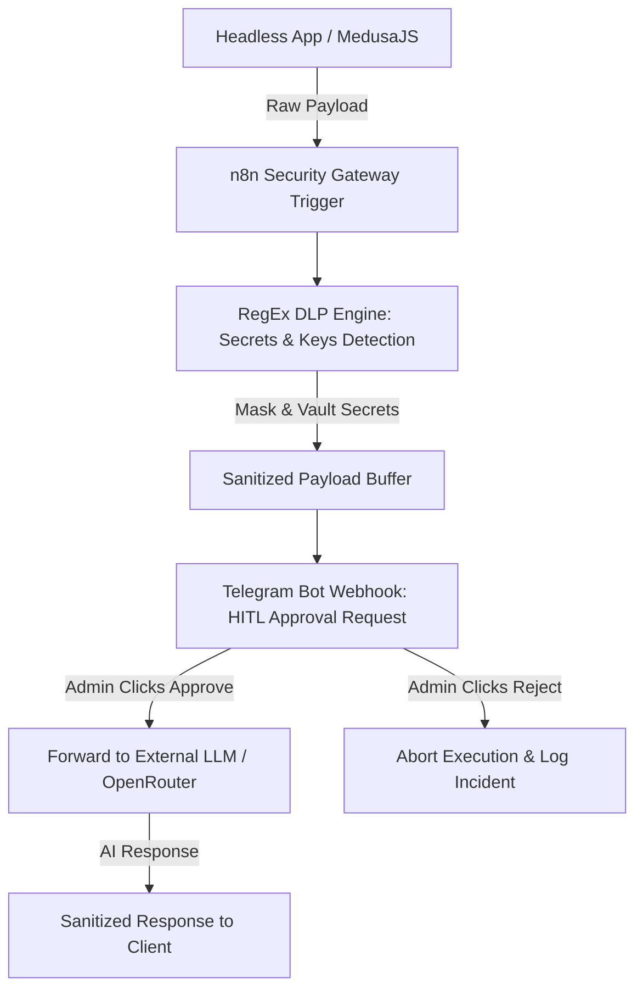

# 🛡️ AI Security Gateway (Human-in-the-Loop)

> An event-driven, Zero-Trust AI security middleware built with **n8n**, **OpenRouter API**, and **Telegram Webhooks**. Features dynamic secrets masking (DLP) and asynchronous Human-in-the-Loop (HITL) manual approval routing.

---

## 🎯 Overview

Deploying LLMs into production exposes systems to token leakage, accidental API key exposure, and uncontrolled automated actions. 

This project provides a lightweight, microservice-ready security gateway. It intercepts payloads bound for external AI providers, applies Data Loss Prevention (DLP) via RegEx masking, vaults sensitive credentials, and holds critical executions in an asynchronous queue until a human operator approves them via Telegram.

---

## 🏗 System Architecture



---

## ✨ Key Features

* **Zero-Trust Data Protection:** Scans all incoming payloads for sensitive patterns (API keys, database URIs, JWTs, personal data) before reaching third-party LLMs.
* **Dynamic RegEx Secret Vaulting:** Automatically replaces detected infrastructure secrets with secure tokens (`[REDACTED_SECRET]`).
* **Asynchronous Human-in-the-Loop (HITL):** Pauses execution flow and triggers an interactive Telegram prompt with full context and approval/rejection buttons.
* **Audit & Incident Logging:** Tracks all pending, approved, and blocked AI interactions for compliance and debugging.

---

## 🛠 Tech Stack

* **Orchestration:** n8n (Workflow Engine)
* **LLM Routing:** OpenRouter API / OpenAI API
* **Security & Inspection:** RegEx Data Masking, Custom JSON Transformers
* **HITL Interface:** Telegram Bot Webhooks & Inline Keyboards

---

## 📩 Payload Handling Example

### Raw Input (Insecure Payload):
```json
{
  "action": "generate_product_description",
  "product_id": "prod_01J3X",
  "context": "Connect to postgres://admin:P@ssword123@db.internal:5432/store and use key sk-or-v1-88f0a2b to query metadata."
}
```

### Sanitized Gateway Output (Bound for OpenRouter):
```json
{
  "action": "generate_product_description",
  "product_id": "prod_01J3X",
  "context": "Connect to [REDACTED_DB_URI] and use key [REDACTED_API_KEY] to query metadata.",
  "hitl_status": "APPROVED_BY_ADMIN",
  "approved_at": "2026-07-26T14:35:10Z"
}
```

---

## 🚀 Quick Start

### Prerequisites
* Running **n8n** instance (Local or Cloud).
* **OpenRouter** or OpenAI API key.
* **Telegram Bot Token** and Admin `chat_id`.

### Installation
1. Clone this repository:
   ```bash
   git clone [https://github.com/Artfarreltuta/n8n-ai-security-gateway.git](https://github.com/Artfarreltuta/n8n-ai-security-gateway.git)
   ```
2. Import `workflow.json` into your n8n workspace.
3. Configure environment variables for `OPENROUTER_API_KEY` and `TELEGRAM_BOT_TOKEN`.
4. Deploy the workflow and connect your client application to the incoming webhook URL.

---

## 📄 License

Distributed under the MIT License. See `LICENSE` for details.
